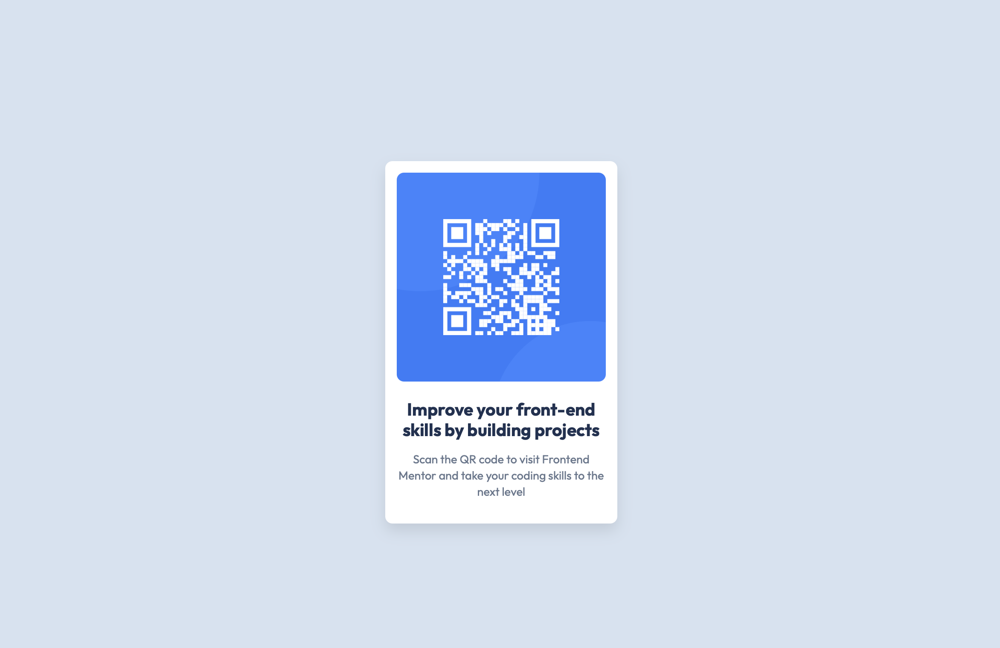
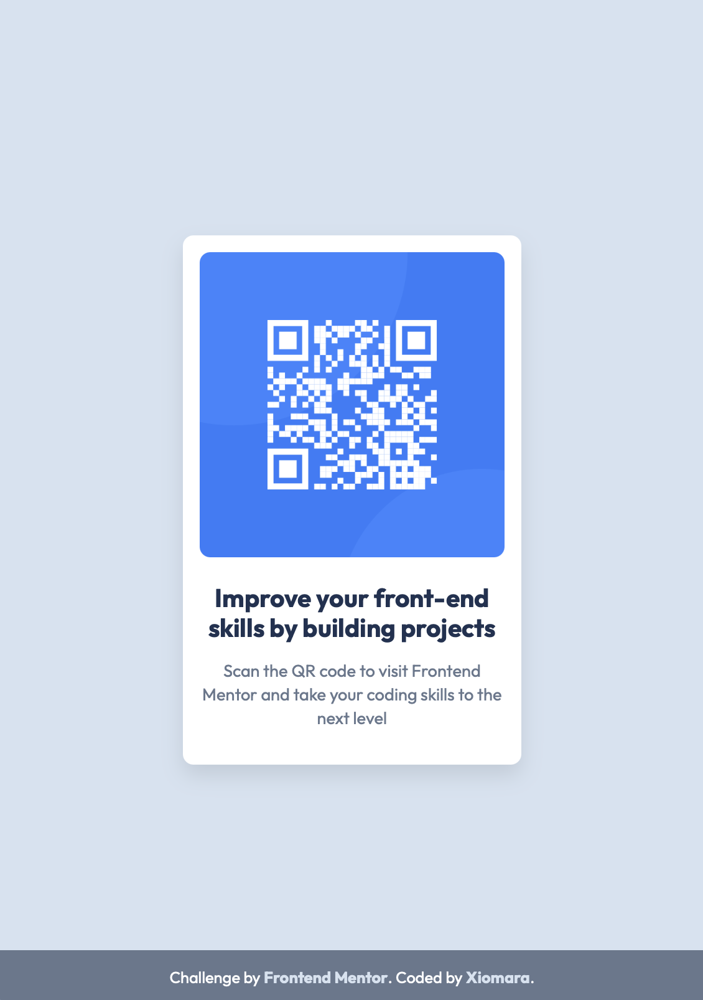

# Frontend Mentor - QR code component solution

This is a solution to the [QR code component challenge on Frontend Mentor](https://www.frontendmentor.io/challenges/qr-code-component-iux_sIO_H). Frontend Mentor challenges help you improve your coding skills by building realistic projects. 

## Table of contents

- [Overview](#overview)
  - [Screenshot](#screenshot)
  - [Links](#links)
- [My process](#my-process)
  - [Built with](#built-with)
  - [Continued development](#continued-development)
  - [Useful resources](#useful-resources)
- [Author](#author)

## Overview

### Screenshot

### Links

- Solution URL: [Solution URL](https://github.com/XiomaraCanizales/frontend-mentor-projects/tree/main/4-QR-code-component/docs)
- Live Site URL: [Live site URL](https://xiomaracanizales.github.io/frontend-mentor-projects/4-QR-code-component/docs/index.html)

## My process

### Built with

- Semantic HTML5 markup
- Vanilla CSS

### Continued development

I have return to Frontend Mentor to get portfolio ready projects. And I'm taking the Learning Path, starting from the beginning, the newbie 🤓

## Author

- [Website](https://xiomara-canizales.netlify.app)
- Frontend Mentor - [@XiomaraCanizales](https://www.frontendmentor.io/profile/XiomaraCanizales)