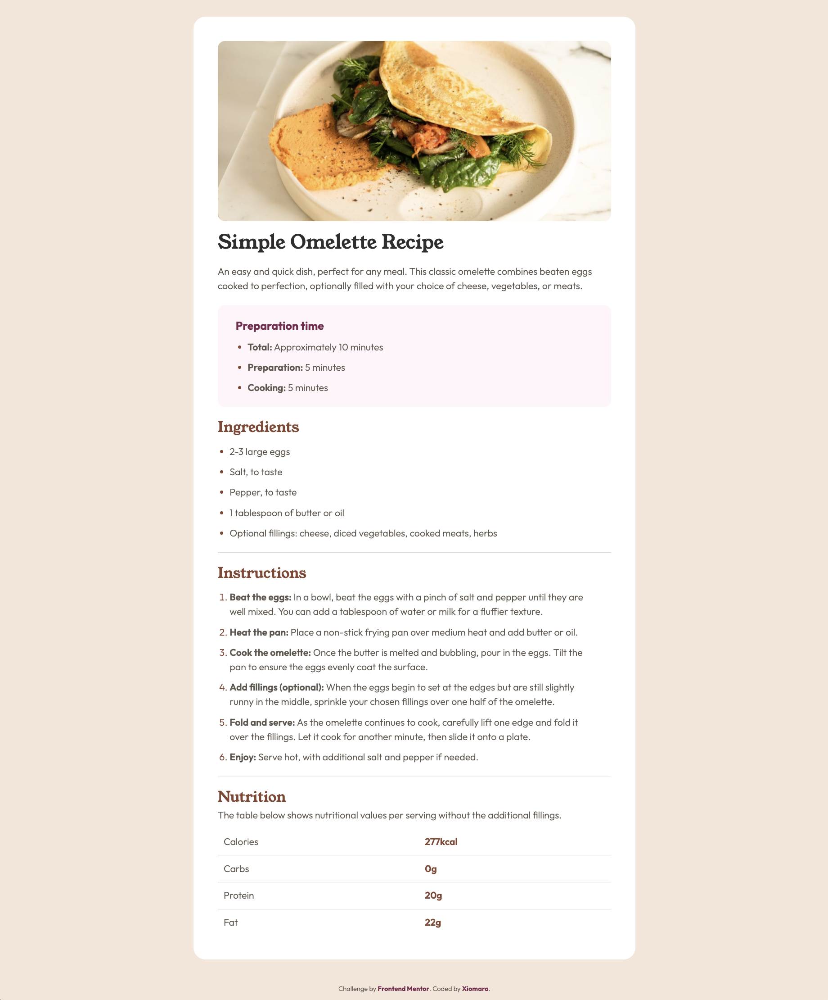
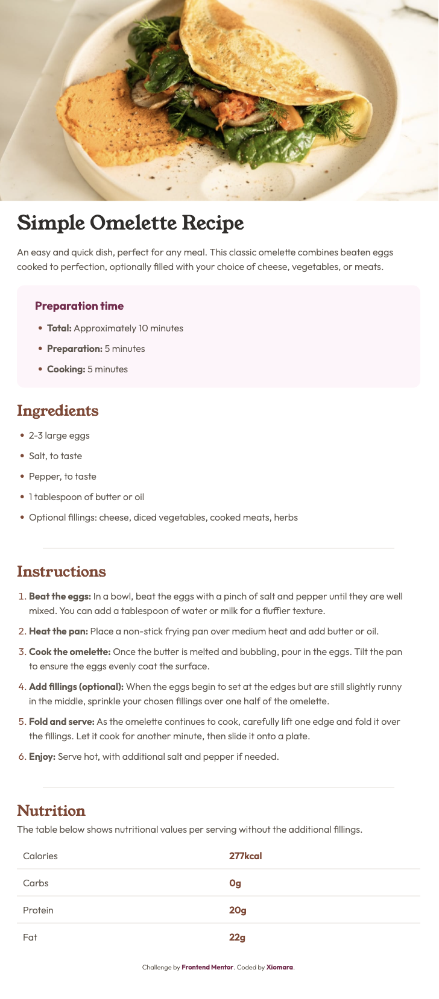

# Frontend Mentor - Recipe page solution

This is a solution to the [Recipe page challenge on Frontend Mentor](https://www.frontendmentor.io/challenges/recipe-page-KiTsR8QQKm). Frontend Mentor challenges help you improve your coding skills by building realistic projects. 

## Table of contents

- [Overview](#overview)
  - [Screenshot](#screenshot)
  - [Links](#links)
- [Author](#author)

## Overview

### Screenshot

- Desktop view

- Mobile view

### Links

- Solution URL: [Solution URL](https://xiomaracanizales.github.io/frontend-mentor-projects/7-recipe-page/docs/index.html)
- Live Site URL: [Live site URL](https://github.com/XiomaraCanizales/frontend-mentor-projects/tree/main/7-recipe-page)

## Author

- [Website](hhttps://xiomara-canizales.netlify.app)
- Frontend Mentor - [@XiomaraCanizales](https://www.frontendmentor.io/profile/XiomaraCanizales)